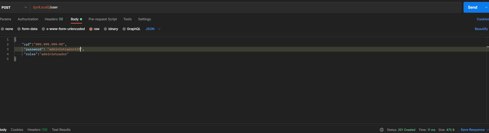
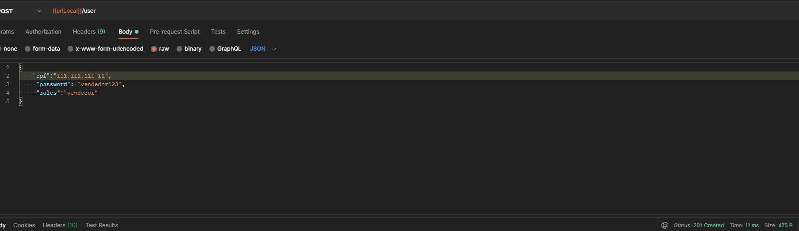
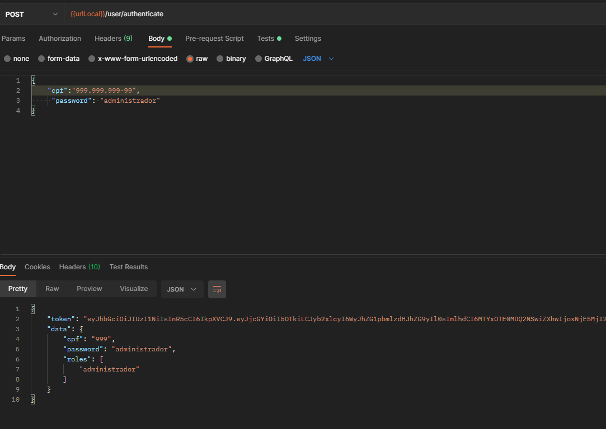
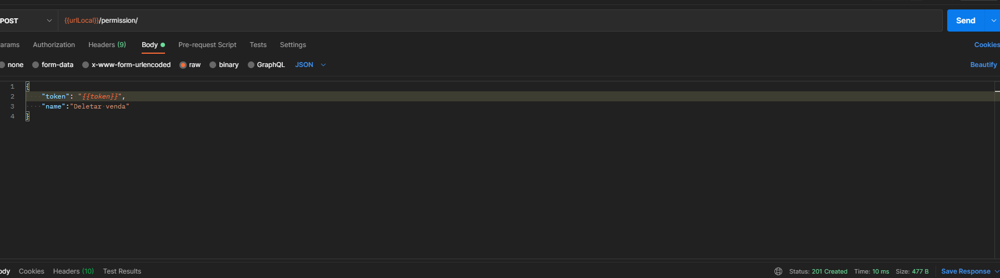
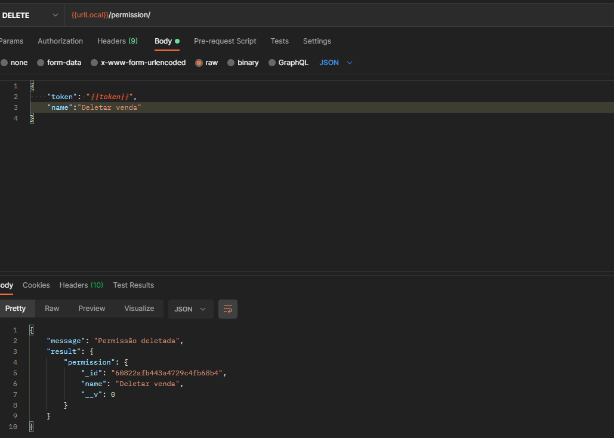
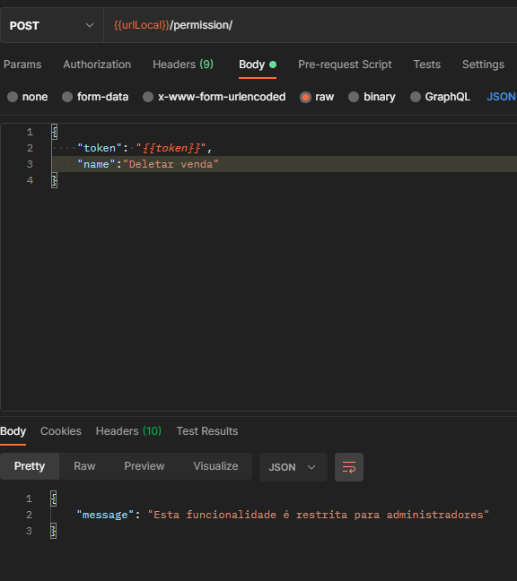
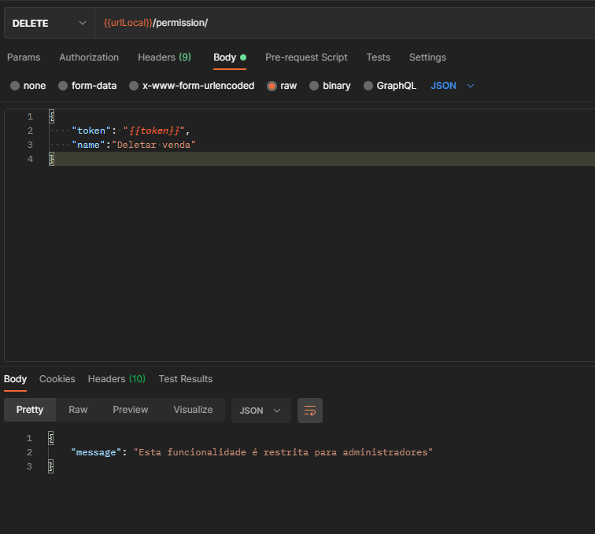

#  Iniciando a API<h1>

Após clonar o repositório em sua máquina, na pasta raiz execute **npm i** para instalar todas as depedências do projeto. Para o MongoDB será necessario uma mudança para o seu banco de dados local atráves do arquivo **server.js**.

Para facilitar os testes foi disponibilizado na pasta postaman_collection uma coleção que poderá ser importado no Postman e utilizado para os testes. 

Para iniciar os teste é necessário que se faça duas requisições atráves da rota "/user" adicionado o cpf, senha e role ("administrador ou vendedor") para testar as duas modalidades.

Como as do exemplo a seguir:

# Cenário a ser testado <h3>

O processo se dá onde um usuário pode enviar seu CPF e uma senha para a API e realizar uma autenticação, recebendo assim um token de acesso contendo seus dados e sua role, feita a autenticação, existem dois casos:

* Se ele for administrador ele pode usar seu token para acessar uma rota para remover uma permissão (enviando o nome dessa permissão) ou adicionar uma permissão (enviando o nome dessa permissão).

* Se ele for vendedor não terá acesso a nenhuma rota.

A autenticação ocorre da seguinte forma; utiizando da rota "/user/authenticate" é passado o cpf e a password do usuário, de forma que é retornado todos os dados incluindo o token gerado: 

Após feita a autenticação do usuário administrador é possível adicionar e remover permissões, no caso exemplificado a model de permissions é composta apenas do nome que a permissão recebéra, a qual é utilizada para ser criada e/ou deletada:

* Permissão Criada:

* Permissão Deletada:

> A rota para ambas e feita atráves de "/permission" tendo a diferença em seus métodos, Post e Delete.

Caso o usuário vendedor tente criar ou deletar permissões ele receberá uma mensagem de aviso:

